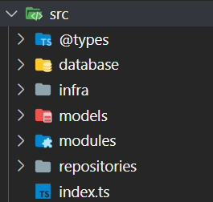

# 🏳️‍🌈 Protótipo Back-End Lacrei

---

## 📌 O Desafio

A ideia é desenvolver uma API de cadastro de pessoas profissionais da área da saúde com as funcionalidades de login e cadastro (em três etapas: pré-cadastro, cadastro e pós-cadastro), visando automatizar o processo atual para assim proporcionar uma melhor experiência para os profissionais, fazendo com que eles se cadastrem e se tornem parceiros.

---

### 🔧 Instalação

Para a **Implantação** dessa aplicação, é necessário seguir o seguinte passo-a-passo:

#### 1 - clonar o repositório

```
git clone https://github.com/EduardoABG/desafio_voluntarios_gama_lacrei_backend
```

#### 2 - Instalar pacotes e dependências

```
npm install
```
#### 3 - Compilar o códio TS para JS

```
tsc
```
#### 4 - Criar um banco de dados local de acordo com a arquitetura do projeto ([Diagrama Entidade-Relacionamento](https://drive.google.com/file/d/17mz9r794bSmmYuLDYlp6ps_Tq2QnZ0xJ/view?usp=sharing)):

* Criar um arquivo .env na raiz do projeto de acordo com .env.exemplo;

* Criar o banco de dados
```
npx sequelize db:create
```

* Criar as tabelas do banco de dados
```
npx sequelize db:migrate
```

* Preencher o banco de dados com as informações pré-definidas
```
node dist/database/carga_inicial
```

#### 5 - Inicializar a API localmente
```
npm run dev
```

---

### 📋 Funcionalidades

A aplicação foi desenvolvida com base nos padrões de arquitetura de projeto com o intuito de tornar a aplicação mais simples e flexível para possíveis implementações futuras.
---



#### As pastas estão organizadas da seguinte forma:
* database: armazena os arquivos de configuração e inicialização do Banco de dados.
* infra: armazena estruturas de configuração da aplicação e middlewares.
* models: armazena a modelagem dos dados e define como eles se relacionam.
* modules: armazena controllers, routes e usecases das requisições.
* repositories: armazena as conexões entre banco de dados e controllers.

---

### 🔧 Ferramentas Utilizadas

#### Foram utilizados as seguintes ferramentas:

* [Typescript](https://www.typescriptlang.org/) - Linguagem de programação
* [Node.JS](https://nodejs.org/en/) - Framework para executar JS fora do navegador
* [Express](https://expressjs.com/pt-br/) - Framework Node.js para criação de APIs
* [Sequelize](https://sequelize.org/) - Mapeador de objetos relacionais para Node.JS
* [bcryptjs](https://www.npmjs.com/package/bcryptjs) - Biblioteca JS para encriptação de dados
* [crypto-js](https://www.npmjs.com/package/crypto-js) - Biblioteca JS de padrões de criptografia
* [dotenv](https://www.npmjs.com/package/dotenv) - Biblioteca JS para carregar variáveis de ambiente
* [jsonwebtoken](https://www.npmjs.com/package/jsonwebtoken) - Biblioteca de implementação para JWT
* [multer](https://www.npmjs.com/package/multer) - Middleware Node.js para upload de arquivos
* [mysql2](https://www.npmjs.com/package/mysql2) - Cliente MySQL para Node.JS
* [winston](https://www.npmjs.com/package/winston) - Biblioteca para cração de loggs
* [xlsx](https://www.npmjs.com/package/xlsx) - Biblioteca JS para trabalhar com planilhas

---

### ✒️ Autores

* [Daniel Campelo](https://github.com/DanielCampelo10)
* [Eduardo Broetto](https://github.com/EduardoABG)

---